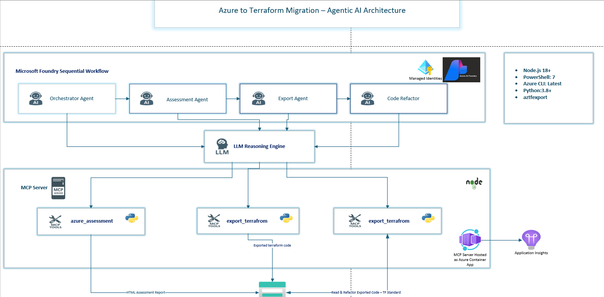
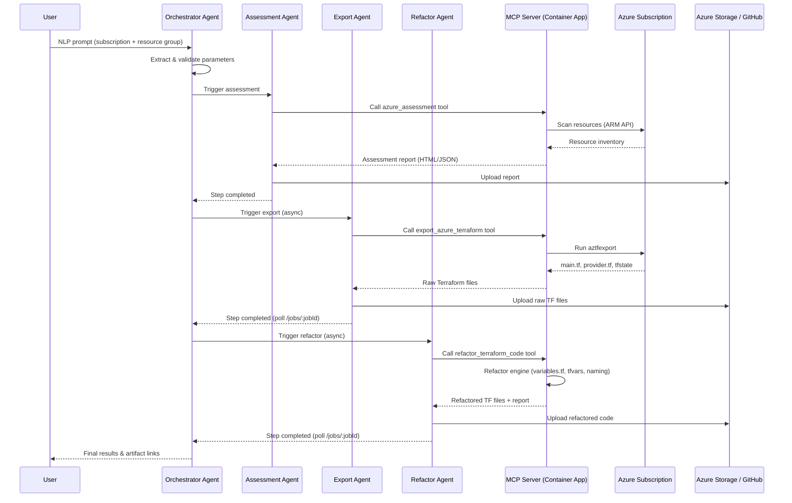

# Azure-to-Terraform Migration — Agentic AI Pipeline

> LLM-driven agents + MCP tools for automated Azure resource assessment, Terraform export, and code refactoring.

**Maintainer**: Sundeep K Maheshwari | **License**: MIT

---

## Table of Contents

1. [System Design & Architecture](#1-system-design--architecture)
2. [Environment Setup](#2-environment-setup)
3. [Docker Build & Container Deployment](#3-docker-build--container-deployment)
4. [Post-Deployment: Secrets & MCP URL Update](#4-post-deployment-secrets--mcp-url-update)
5. [Azure AI Foundry Agent Setup](#5-azure-ai-foundry-agent-setup)
6. [Running the Sequential Workflow](#6-running-the-sequential-workflow)
7. [Agents & Workflow Details](#7-agents--workflow-details)
8. [API — Agentic Workflow REST + SSE Server](#8-api--agentic-workflow-rest--sse-server-api_serverpy)
9. [GitHub Integration](#9-github-integration)
10. [MCP Inspector & Debugging](#10-mcp-inspector--debugging)
11. [Troubleshooting & Fixes](#11-troubleshooting--fixes)
12. [UI Integration — End-to-End Agentic Workflow](#12-ui-integration--end-to-end-agentic-workflow-ai-aztfexport-ui)
13. [Operational Commands (Merged from command.md)](#13-operational-commands-merged-from-commandmd)

---

## 1. System Design & Architecture

### Architecture Diagram



> Source Visio file: [Architecture.vsdx](Architecture.vsdx)

### Sequence Diagram — Agent Workflow


<details>
<summary>Mermaid source (click to expand)</summary>



</details>


### Directory Structure

```
apps-mcp-server/
├── index.js                    # NODE JS Main MCP server entry & SSE logic
├── Dockerfile                  # Container image definition
├── deploy.ps1                  # End-to-end Azure deployment script
├── .env                        # Environment configuration (DO NOT COMMIT)
├── tools/                      # MCP tool definitions
│   ├── assessment.js
│   ├── aztfexport.js
│   └── code-refactor.js
├── python/                     # Python engines & workflow
│   ├── assessment-AzSubscription.py  # Azure resource assessment engine
│   ├── Export-Container-AzToTerraform.py  # Terraform export engine
│   ├── refactor.py             # Refactor entry point
│   ├── tf_refactor_variable.py # Refactoring logic
│   ├── github_helper.py        # GitHub API integration
│   └── az-fndry-workflow/
│       └── aztf-sequential-wf.py  # Sequential Azure Foundry workflow
└── package.json
```

---

## 2. Environment Setup

### Prerequisites

| Tool | Version | Purpose |
|------|---------|---------|
| **Node.js** | 18+ | MCP server runtime |
| **PowerShell** | 7.x | Assessment & export scripts |
| **Azure CLI** | Latest | `az login` or SPN auth |
| **Python** | 3.10+ | Sequential workflow & refactor engine |
| **aztfexport** | Latest | Must be installed and in PATH |
| **Docker** | Latest | Container build & deployment |

### Install Python Dependencies

```bash
# Azure AI Foundry workflow dependencies
pip install "azure-ai-projects>=2.0.0b4" "openai>=2.24.0" "azure-identity>=1.25.0" "python-dotenv>=1.0.0"

# Assessment & refactor engine dependencies
pip install azure-storage-blob azure-mgmt-resource azure-mgmt-subscription PyYAML requests python-hcl2 jinja2
```

Or install all at once:
```bash
pip install -r apps-mcp-server/python/requirements.txt
```

### Install Node.js Dependencies

```bash
cd apps-mcp-server
npm install
```

### Configure `.env` File

Create/update `apps-mcp-server/.env` with the following values:

```bash
# ===============================================
# Server Configuration
# ===============================================
PORT=3000
LOG_LEVEL=info

# ===============================================
# Azure Authentication (Service Principal)
# ===============================================
AZURE_CLIENT_ID=<your-service-principal-app-id>
AZURE_CLIENT_SECRET=<your-service-principal-secret>
AZURE_TENANT_ID=<your-azure-tenant-id>
AZURE_OBJECT_ID=<your-service-principal-object-id>

# ===============================================
# MCP Server URL (UPDATE AFTER CONTAINER DEPLOYMENT)
# ===============================================
# This is the Container App FQDN — update after running deploy.ps1
MCP_SERVER_URL=https://<your-container-app-name>.<hash>.<region>.azurecontainerapps.io/

# ===============================================
# Azure AI Foundry Project
# ===============================================
AZURE_AI_PROJECT_ENDPOINT=https://<foundry-resource>.services.ai.azure.com/api/projects/<project-name>

# ===============================================
# Output Destination: "azure" | "github" | "both"
# ===============================================
OUTPUT_DESTINATION=both

# Azure Storage (required if destination = azure or both)
storageAccountRG=rg-mcp-servers
storageAccount=samcpstorage

# GitHub (required if destination = github or both)
GITHUB_TOKEN=<your-github-pat>
GITHUB_OWNER=<your-github-org-or-user>
GITHUB_REPO=<your-terraform-repo>
GITHUB_BRANCH=main

# ===============================================
# Script Paths
# ===============================================
POWERSHELL_SCRIPT_PATH=./ps/assessment-AzSubscription.ps1
EXPORT_SCRIPT_PATH=./ps/Export-AzToTerraform.ps1
REFACTOR_SCRIPT_PATH=./python/refactor.py

# ===============================================
# Job Polling (optional tuning)
# ===============================================
JOB_POLL_INTERVAL=15
JOB_POLL_TIMEOUT=1800
JOB_HEARTBEAT_LOG=60
```

### Azure Service Principal Setup

```bash
# Create SPN with Contributor role
az ad sp create-for-rbac --name <sp-name> --role Contributor \
  --scopes /subscriptions/<subscription-id>

# Note the appId, password, and tenant from the output
# Update .env with these values
```

### Output Folder Structure

| Artifact | Storage Path |
|----------|-------------|
| Assessment Reports | `assessment-reports/{subscription_id}/` |
| Export Output | `aztfexport/{subscription_id}/{rg_name}/` |
| Refactored Code | `code-refactored/{subscription_id}/{rg_name}/` |

---

## 3. Docker Build & Container Deployment

### Docker Commands

```bash
# Navigate to the MCP server directory
cd apps-mcp-server

# Build the Docker image
docker build --no-cache -t aztf-mcp-server:v2.3 .

# Test locally (optional)
docker run -p 3000:3000 --env-file .env aztf-mcp-server:v2.3

# Tag for ACR
docker tag aztf-mcp-server:v2.3 <your-acr-name>.azurecr.io/aztf-mcp-server:v2.3

# Login to ACR
az acr login --name <your-acr-name>

# Push to ACR
docker push <your-acr-name>.azurecr.io/aztf-mcp-server:v2.3
```

### Automated Deployment via `deploy.ps1`

The `deploy.ps1` script handles everything end-to-end: ACR creation, Docker build, push, Container App creation, environment variables, and secrets.

```powershell
.\deploy.ps1 `
  -ResourceGroupName "rg-mcp-servers" `
  -SubscriptionId "<subscription-id>" `
  -TenantId "<tenant-id>" `
  -ClientId "<client-id>" `
  -StorageAccountName "samcpstorage" `
  -ContainerName "aztfexport" `
  -ContainerAppName "aztf-mcp-app" `
  -LogAnalyticsWorkspace "workspace-rgmcpserversIh7a" `
  -AcrName "aztfmcpacr" `
  -ImageTag "v2.3" `
  -Port 3000 `
  -MinReplicas 0 `
  -MaxReplicas 1 `
  -Cpu 0.25 `
  -Memory "0.5Gi" `
  -NoCache
```

#### Deployment Parameters

| Parameter | Default | Description |
|-----------|---------|-------------|
| `ResourceGroupName` | `rg-aztf-mcp-prod` | Azure Resource Group |
| `Location` | `eastus` | Azure region |
| `AcrName` | — | Azure Container Registry name |
| `SubscriptionId` | — | Azure Subscription ID |
| `ContainerAppName` | — | Container App name |
| `LogAnalyticsWorkspace` | — | Log Analytics Workspace |
| `ImageTag` | `latest` | Docker image tag |
| `Port` | `8080` | Application port |
| `Cpu` | `1.0` | CPU cores |
| `Memory` | `2.0Gi` | Memory allocation |
| `MinReplicas` | `1` | Minimum replicas |
| `MaxReplicas` | `3` | Maximum replicas |
| `SkipBuild` | `false` | Skip Docker build step |

---

## 4. Post-Deployment: Secrets & MCP URL Update

> **IMPORTANT** — These steps must be done manually after every container deployment.

### Step 1: Update Secrets in Container App

After the container is deployed, go to the **Azure Portal** and update the secrets manually:


1. Navigate to **Container Apps** → your app (e.g., `aztf-mcp-app`)
2. Go to **Environment Settings** → **Secrets** (Will Do This AUtomation in future)
3. Copy the following values from your `.env` file and add/update them:

| Secret Name | Source (.env key) |
|-------------|-------------------|
| `azure-client-secret` | `AZURE_CLIENT_SECRET` |
| `github-token` | `GITHUB_TOKEN` |

> Secrets are referenced in environment variables via `secretref:azure-client-secret`. The deploy script maps `AZURE_CLIENT_SECRET` and `ARM_CLIENT_SECRET` to this secret automatically.

### Step 2: Get the Container App URL

```bash
# Get the FQDN of the deployed container app
az containerapp show \
  --name aztf-mcp-app \
  --resource-group rg-mcp-servers \
  --query properties.configuration.ingress.fqdn -o tsv
```

This will return something like:
```
aztf-mcp-app.livelyflower-5ea8a87a.centralus.azurecontainerapps.io
```

### Step 3: Update MCP URL in `.env`

Update `MCP_SERVER_URL` in your `.env` file with the Container App URL:

```bash
MCP_SERVER_URL=https://aztf-mcp-app.<hash>.<region>.azurecontainerapps.io/
```

### Step 4: Update MCP URL in Azure AI Foundry Tool Connection

Each Foundry Agent must have its **MCP SSE connection** pointed to the Container App URL:

1. Open **Azure AI Foundry** portal
2. Navigate to each agent:
   - `aztf-assessment-v1`
   - `aztf-export-v1`
   - `aztf-coderefactor-v1`
3. Go to **Tools** → **MCP (SSE)** connection
4. Update the URL to:
   ```
   https://aztf-mcp-app.<hash>.<region>.azurecontainerapps.io/sse
   ```

### Managed Identity Permissions

The Container App needs **System-Assigned Managed Identity** enabled with **Storage Blob Data Contributor** role:

```bash
az role assignment create \
  --assignee $IDENTITY_PRINCIPAL_ID \
  --role "Storage Blob Data Contributor" \
  --scope /subscriptions/<sub-id>/resourceGroups/<rg>/providers/Microsoft.Storage/storageAccounts/samcpstorage
```

---

## 5. Azure AI Foundry Agent Setup

### Required Foundry Resources

1. An **Azure AI Foundry** project with a deployed model (e.g., `gpt-4o`)
2. Four **Foundry Agents** created and connected to the MCP server tool set:

| Agent Name | Purpose | MCP Tool |
|-----------|---------|----------|
| `aztf-orchestrator-v1` | NLP parameter extraction | — (direct LLM) |
| `aztf-assessment-v1` | Azure resource assessment | `azure_assessment` |
| `aztf-export-v1` | Terraform export (async) | `export_azure_terraform` |
| `aztf-coderefactor-v1` | Code refactoring (async) | `refactor_terraform_code` |

### Agent MCP Tool Configuration

Each agent (except orchestrator) must have the **MCP SSE** connection configured:

- **Connection Type**: MCP (Server-Sent Events)
- **URL**: `https://<container-app-fqdn>/sse`

### Required `.env` Variables for Foundry Workflow

| Variable | Example | Description |
|----------|---------|-------------|
| `AZURE_AI_PROJECT_ENDPOINT` | `https://<resource>.services.ai.azure.com/api/projects/<project>` | Foundry project endpoint |
| `MCP_SERVER_URL` | `https://aztf-mcp-app.<hash>.<region>.azurecontainerapps.io/` | Container App base URL |
| `AZURE_CLIENT_ID` | `4a7f6b45-...` | Service Principal App ID |
| `AZURE_CLIENT_SECRET` | `skC8Q~...` | Service Principal secret |
| `AZURE_TENANT_ID` | `a0e1f124-...` | Azure AD Tenant ID |

---

## 6. Running the Sequential Workflow

The sequential workflow runs all four agents in order: Orchestrator → Assessment → Export → Refactor.

### Step 1: Start the API Server (Required for UI)

The UI communicates with the pipeline through a FastAPI server on port 8000. Start it **before** using the UI:

```powershell
# Navigate to the workflow directory
cd apps-mcp-server/python/az-fndry-workflow

# Install dependencies (first time only)
pip install fastapi "uvicorn[standard]"

# Start the API server
python -m uvicorn api_server:app --host 0.0.0.0 --port 8000 --reload
```

- Swagger UI: `http://localhost:8000/docs`
- Health check: `http://localhost:8000/health`

### Step 2: Start the Next.js UI (Optional)

```powershell
cd ai-aztfexport-ui
npm run dev          # http://localhost:3000
```

Open `http://localhost:3000` → **Workflow** menu → type your migration prompt → click the arrow button.

### Step 3: Run the Pipeline

**Option A — From UI (Workflow page):**

Type a natural language prompt in the command center, e.g.:
```
Migrate resource group 'rg-mcp-servers' from subscription d0f1884d-1f98-4bf1-9e15-e2986fc1bca2
```
The Orchestrator agent extracts `subscriptionId` and `resourceGroup` from the prompt automatically.

**Option B — From CLI (direct Python):**

```bash
cd apps-mcp-server/python/az-fndry-workflow

# Pass the prompt as a CLI argument
python aztf-sequential-wf.py "Migrate resource group 'rg-mcp-servers' from subscription d0f1884d-1f98-4bf1-9e15-e2986fc1bca2"
```

**Option C — From CLI (env var fallback):**

If no argument is provided, the script constructs a prompt from environment variables:
```bash
# Set in .env or shell
export AZURE_SUBSCRIPTION_ID="d0f1884d-1f98-4bf1-9e15-e2986fc1bca2"
export AZURE_RESOURCE_GROUP="rg-mcp-servers"

python aztf-sequential-wf.py
```

The workflow:
1. Loads `.env` from its directory and the parent `apps-mcp-server/.env`
2. Authenticates via Service Principal (`AZURE_CLIENT_ID` / `AZURE_CLIENT_SECRET`)
3. Runs each agent sequentially via the Foundry SDK
4. Polls `/jobs/:jobId` on the MCP server for async export/refactor completion
5. Outputs results and artifact links

### Local MCP Server Development

For local testing without deployment, use the run script:

```powershell
# Start MCP server locally
.\apps-mcp-server\mcpserver-run.ps1

# With custom port
.\apps-mcp-server\mcpserver-run.ps1 -Port 3000 -ShowDetails
```

---

## 7. Agents & Workflow Details

### 1. Migration Orchestrator Agent

**Purpose**: Extracts and validates user migration requirements from natural language.

- **Input**: User prompt (e.g., *"Migrate rg-app from sub-123"*)
- **Output**:
  ```json
  {
    "subscriptionId": "d0f1884d-1f98-4bf1-9e15-e2986fc1bca2",
    "resourceGroups": ["rg-app-dev", "rg-data-dev"],
    "outPath": "/assessment"
  }
  ```

### 2. Assessment Agent (`infraAzTfAssessmentAgent-v1`)

**Purpose**: Performs managed-only Azure resource assessment.

- Calls `azure_assessment` MCP tool
- Generates HTML/PDF/XLSX reports
- **Output**: Report artifacts uploaded to `assessment-reports/`

### 3. Export Tool (`AztfExportPS-Tool`)

**Purpose**: Exports Azure resources to Terraform HCL and tfstate.

- Runs `aztfexport` via PowerShell
- Handles authentication and temp file management
- **Output**: `main.tf`, `provider.tf`, `terraform.tfstate` → `aztfexport/`

### 4. Refactor Agent (`TerraformRefactor-Agent`)

**Purpose**: Refactors exported code using naming standards and tagging rules.

- Runs `refactor.py` → `tf_refactor_variable.py`
- Enforces tags (owner, businessUnit, etc.)
- Generates `variables.tf`, `terraform.tfvars`, `providers.tf`, `data-sources.tf`
- Applies naming conventions from `naming-standard.json`
- Does NOT add remote backend (preserves local state)
- **Output**: Refactored `.tf` files → `code-refactored/`

---

## 8. API — Agentic Workflow REST + SSE Server (`api_server.py`)

The sequential workflow is exposed as a REST + SSE API via **FastAPI**. The wrapper lives at `apps-mcp-server/python/az-fndry-workflow/api_server.py` and imports `run_aztf_enterprise_pipeline` from `aztf-sequential-wf.py` **without modifying** any existing Python code.

### How It Works

1. **Import only** — `api_server.py` uses `importlib.import_module("aztf-sequential-wf")` to load the existing pipeline function.
2. **Background thread** — Each `POST /api/workflow/start` spawns a daemon thread running the pipeline.
3. **Stdout capture** — A `WorkflowLogCapture` stream replaces `sys.stdout`/`sys.stderr` during execution, parsing ANSI-colored console output into structured JSON log events.
4. **In-memory job store** — `JobManager` stores job state, progress percentage, current agent, and a per-job SSE event buffer. No external database required.
5. **SSE streaming** — The `/api/jobs/{jobId}/progress` endpoint returns a `text/event-stream` response, pushing `log`, `status`, and `complete` events in real time.

### API Endpoints

| Method | Endpoint | Description |
|--------|----------|-------------|
| `POST` | `/api/workflow/start` | Start the 4-agent pipeline, returns a `jobId` |
| `GET` | `/api/jobs/{jobId}` | Snapshot of job status, progress, and full log history |
| `GET` | `/api/jobs/{jobId}/progress` | **SSE stream** — real-time log events + status heartbeats |
| `GET` | `/api/jobs` | List all jobs (id, status, progress, currentAgent) |
| `GET` | `/health` | Health check |
| `GET` | `/docs` | Swagger UI (auto-generated by FastAPI) |

### Request Model — `WorkflowRequest`

```python
class WorkflowRequest(BaseModel):
    prompt: str = Field(..., min_length=10, description="Natural language migration prompt containing subscription ID and resource group")
```

Example:
```json
{
  "prompt": "Migrate resource group 'rg-mcp-servers' from subscription d0f1884d-1f98-4bf1-9e15-e2986fc1bca2"
}
```

### Response Model — `WorkflowResponse` (returned by `POST /api/workflow/start`)

```python
class WorkflowResponse(BaseModel):
    jobId: str        # UUID assigned to this run
    status: str       # "queued"
    message: str      # "Agentic workflow started"
    timestamp: str    # ISO-8601
```

### Job Status Model — `JobProgress` (returned by `GET /api/jobs/{jobId}`)

```python
class JobProgress(BaseModel):
    jobId: str
    status: str                        # queued | running | completed | failed
    currentAgent: Optional[str]        # Orchestrator | Assessment | Export | Refactor
    progress: int                      # 0–100
    logs: list[dict]                   # array of log entries
    error: Optional[str]               # error message if status == failed
    result: Optional[str]
```

Each log entry:

```json
{
  "level": "info",
  "message": "Agent started: Assessment",
  "agent": "Assessment",
  "timestamp": "2026-04-01T10:05:12.345Z"
}
```

### SSE Event Types (from `/api/jobs/{jobId}/progress`)

| Event | Payload | When |
|-------|---------|------|
| `connected` | `{ jobId, message }` | On initial SSE connection |
| `log` | `{ level, message, agent, timestamp }` | Each pipeline console line |
| `status` | `{ jobId, status, progress, currentAgent }` | Every 5 s heartbeat |
| `complete` | `{ jobId, status, progress, error }` | Pipeline finished or failed |

### Agent-to-Progress Mapping

The `WorkflowLogCapture` class detects `[ACTIVE AGENT]` labels in stdout and maps them to progress:

| Foundry Agent Name | UI Label | Progress % |
|--------------------|----------|-----------|
| `aztf-orchestrator-v1` | Orchestrator | 10 |
| `aztf-assessment-v1` | Assessment | 35 |
| `aztf-export-v1` | Export | 60 |
| `aztf-coderefactor-v1` | Refactor | 85 |

Pipeline completion sets progress to **100**.

### Running Locally

```bash
cd apps-mcp-server/python/az-fndry-workflow

# Install dependencies (if not done)
pip install fastapi "uvicorn[standard]"

# Start the API server on port 8000
python -m uvicorn api_server:app --host 0.0.0.0 --port 8000 --reload
```

- Swagger: `http://localhost:8000/docs`
- Health: `http://localhost:8000/health`

### Quick Test with curl

```bash
# Start a workflow with NLP prompt
curl -X POST http://localhost:8000/api/workflow/start \
  -H "Content-Type: application/json" \
  -d '{"prompt":"Migrate resource group '\''rg-mcp-servers'\'' from subscription d0f1884d-1f98-4bf1-9e15-e2986fc1bca2"}'

# Stream progress (replace <jobId> with the returned jobId)
curl -N http://localhost:8000/api/jobs/<jobId>/progress
```

### Hosting as Azure Container App

The API server can be deployed **alongside** the existing MCP Node.js server or as a **separate** Container App.

#### Option A: Separate Container App (recommended)

1. **Create a Dockerfile** for the workflow API:

```dockerfile
FROM python:3.11-slim
WORKDIR /app
COPY python/requirements.txt .
RUN pip install --no-cache-dir -r requirements.txt
COPY python/ ./python/
COPY .env .env
WORKDIR /app/python/az-fndry-workflow
EXPOSE 8000
CMD ["uvicorn", "api_server:app", "--host", "0.0.0.0", "--port", "8000"]
```

2. **Build, push, and deploy**:

```bash
docker build -f Dockerfile.workflow -t aztf-workflow-api:v1 .
docker tag aztf-workflow-api:v1 <acr>.azurecr.io/aztf-workflow-api:v1
az acr login --name <acr>
docker push <acr>.azurecr.io/aztf-workflow-api:v1

az containerapp create \
  --name aztf-workflow-api \
  --resource-group rg-mcp-servers \
  --image <acr>.azurecr.io/aztf-workflow-api:v1 \
  --target-port 8000 \
  --ingress external \
  --min-replicas 0 --max-replicas 1 \
  --cpu 1.0 --memory 2.0Gi \
  --env-vars AZURE_AI_PROJECT_ENDPOINT=<endpoint> MCP_SERVER_URL=<mcp-url> \
  --secrets azure-client-secret=<secret> \
  --secret-env-vars AZURE_CLIENT_SECRET=secretref:azure-client-secret
```

3. **Update UI config** — set `NEXT_PUBLIC_WORKFLOW_API_URL` to the Container App FQDN.

#### Option B: Add to existing MCP Dockerfile

Append the Python API startup alongside Node.js using a process manager or a multi-command entrypoint.

---

## 9. GitHub Integration

### Setup

1. Generate a GitHub PAT with `repo` scope
2. Update `.env` with `GITHUB_TOKEN`, `GITHUB_OWNER`, `GITHUB_REPO`
3. Set `OUTPUT_DESTINATION=github` or `both`

### Security Features

- **Branch Protection**: Uploads to specified branch
- **.gitignore Generation**: Auto-excludes `terraform.tfstate`, `.terraform/`
- **SHA Checking**: Avoids unnecessary commits by checking existing file SHAs

---

## 10. MCP Inspector & Debugging

### Testing with MCP Inspector

```bash
# Install/run MCP Inspector
npx @modelcontextprotocol/inspector

# Test local server
npx @modelcontextprotocol/inspector http://localhost:3000/sse

# Test deployed container
npx @modelcontextprotocol/inspector https://<container-app-fqdn>/sse
```

### Stop MCP Port

```powershell
netstat -ano | findstr :3000
taskkill /PID <pid> /F
```

### View Container Logs

```bash
az containerapp logs show --name aztf-mcp-app --resource-group rg-mcp-servers --follow
```

---

## 11. Troubleshooting & Fixes

| Issue | Cause | Fix |
|-------|-------|-----|
| `StorageAccount parameter is required` | Env vars not passed to spawned process | Ensure `tools/aztfexport.js` includes `env: { ...process.env }` |
| Invalid JobId Parameter | Old PS script expected `-JobId` | Updated — uses `{SubscriptionId}/{ResourceGroup}` path |
| SSE Disconnects | MCP SDK or proxy issues | Use Stdio mode for production; ensure client auto-reconnects |
| GitHub Upload 403/404 | Token scope or repo name | Verify PAT has `repo` scope; check `GITHUB_OWNER` |
| `SecretRef not found` | Secret not set in Container App | Manually add secret via Azure Portal (see Section 4) |
| `variables.tf` empty | Refactor engine bug — empty lookup dicts | Fixed in `tf_refactor_variable.py` (populate from variables OrderedDict) |

### Foundry References

- [Agent Framework Workflow Samples](https://github.com/microsoft/agent-framework/blob/main/workflow-samples/CustomerSupport.yaml#L29)
- [Power Fx JSON](https://learn.microsoft.com/en-us/power-platform/power-fx/working-with-json)
- [Foundry Discussions](https://github.com/orgs/microsoft-foundry/discussions/218)

---

## 12. UI Integration — End-to-End Agentic Workflow (`ai-aztfexport-ui`)

The **Next.js** frontend (`ai-aztfexport-ui`) integrates with the FastAPI `api_server.py` to let users trigger the full 4-agent pipeline from the browser with real-time streaming progress.

### Architecture Overview

```
┌─────────────────────────────────┐     REST + SSE      ┌──────────────────────────────────┐
│  ai-aztfexport-ui (Next.js)     │ ──────────────────►  │  api_server.py (FastAPI :8000)    │
│                                 │                      │                                  │
│  MigrationPage.tsx              │   POST /api/         │  Imports run_aztf_enterprise_     │
│    ├── useAgenticWorkflow.ts    │   workflow/start     │  pipeline() from aztf-sequential  │
│    │    └── workflowService.ts  │ ◄────────────────    │  -wf.py (UNCHANGED)              │
│    │         └── config.ts      │   { jobId }          │                                  │
│    │                            │                      │  Runs pipeline in background      │
│    └── [SSE EventSource]        │   GET /api/jobs/     │  thread, captures stdout into     │
│         onLog / onStatus /      │   {jobId}/progress   │  structured SSE events            │
│         onComplete              │ ◄═══════════════     │                                  │
└─────────────────────────────────┘   text/event-stream  └──────────────────────────────────┘
                                                                      │
                                                                      ▼
                                                         ┌──────────────────────────────────┐
                                                         │  Azure AI Foundry (4 Agents)      │
                                                         │  + MCP Server (Container App)     │
                                                         │  + Azure Storage                  │
                                                         └──────────────────────────────────┘
```

### Integration Points — File-by-File

| Layer | File | Role |
|-------|------|------|
| **Config** | `ai-aztfexport-ui/app/services/config.ts` | Reads `NEXT_PUBLIC_WORKFLOW_API_URL` env var, builds endpoint URLs |
| **Service** | `ai-aztfexport-ui/app/services/workflowService.ts` | HTTP + SSE calls to the FastAPI server |
| **Hook** | `ai-aztfexport-ui/app/hooks/useAgenticWorkflow.ts` | React state machine — manages jobId, status, progress, logs, SSE lifecycle |
| **Page** | `ai-aztfexport-ui/app/components/pages/MigrationPage.tsx` | UI layer — mode toggle, inputs, progress bar, agent badges, log terminal |
| **API** | `apps-mcp-server/python/az-fndry-workflow/api_server.py` | FastAPI wrapper — background thread, stdout capture, SSE streaming |
| **Pipeline** | `apps-mcp-server/python/az-fndry-workflow/aztf-sequential-wf.py` | **Unchanged** — the 4-agent pipeline (Orchestrator → Assessment → Export → Refactor) |

### Step 1 — Configuration (`config.ts`)

The `config.ts` singleton loads two separate base URLs from environment variables:

```typescript
const mcpBaseUrl = process.env.NEXT_PUBLIC_MCP_SERVER_URL || 'http://localhost:8080';       // Node.js MCP server
const workflowBaseUrl = process.env.NEXT_PUBLIC_WORKFLOW_API_URL || 'http://localhost:8000'; // FastAPI workflow API
```

Workflow endpoints are built from `workflowBaseUrl`:

| Config Key | URL |
|------------|-----|
| `config.workflow.endpoints.start` | `{baseUrl}/api/workflow/start` |
| `config.workflow.endpoints.jobStatus(jobId)` | `{baseUrl}/api/jobs/{jobId}` |
| `config.workflow.endpoints.jobProgress(jobId)` | `{baseUrl}/api/jobs/{jobId}/progress` |
| `config.workflow.endpoints.listJobs` | `{baseUrl}/api/jobs` |

### Step 2 — Service Layer (`workflowService.ts`)

The service layer provides typed functions that talk to the API. No business logic — pure HTTP/SSE transport.

#### TypeScript Request/Response Models

```typescript
// Request — sent to POST /api/workflow/start
interface WorkflowStartRequest {
  subscriptionId: string;
  resourceGroup: string;
}

// Response — returned from POST /api/workflow/start
interface WorkflowStartResponse {
  jobId: string;       // UUID assigned to the run
  status: string;      // "queued"
  message: string;     // "Agentic workflow started"
  timestamp: string;   // ISO-8601
}

// Job snapshot — returned from GET /api/jobs/{jobId}
interface WorkflowJobStatus {
  jobId: string;
  status: 'queued' | 'running' | 'completed' | 'failed';
  currentAgent: string | null;   // Orchestrator | Assessment | Export | Refactor
  progress: number;              // 0–100
  logs: WorkflowLogEntry[];
  error: string | null;
  result: string | null;
}

// Individual log entry (in logs array and SSE "log" events)
interface WorkflowLogEntry {
  level: 'info' | 'warn' | 'error' | 'success';
  message: string;
  agent: string | null;
  timestamp: string;
}
```

#### Key Functions

| Function | What It Does |
|----------|-------------|
| `startAgenticWorkflow(subId, rg)` | `POST /api/workflow/start` — returns `WorkflowStartResponse` |
| `getWorkflowJobStatus(jobId)` | `GET /api/jobs/{jobId}` — returns `WorkflowJobStatus` |
| `streamWorkflowProgress(jobId, callbacks)` | Opens `EventSource` to `/api/jobs/{jobId}/progress`, dispatches `onLog`, `onStatus`, `onComplete`, `onError` callbacks. Returns the `EventSource` handle. |
| `closeWorkflowStream(es)` | Closes an open `EventSource` |
| `listWorkflowJobs()` | `GET /api/jobs` — returns array of job summaries |

### Step 3 — React Hook (`useAgenticWorkflow.ts`)

The hook encapsulates all workflow state and SSE lifecycle management.

#### Exposed State

| Field | Type | Description |
|-------|------|-------------|
| `jobId` | `string \| null` | Current job UUID |
| `status` | `WorkflowStatus` | `idle` · `starting` · `running` · `completed` · `failed` · `disconnected` |
| `currentAgent` | `string \| null` | Which pipeline agent is active |
| `progress` | `number` | 0–100 |
| `logs` | `WorkflowProgressLog[]` | Accumulated log entries with `type`, `message`, `agent`, `timestamp` |
| `isRunning` | `boolean` | `true` when `status` is `starting` or `running` |
| `error` | `string \| null` | Error message if failed |

#### Exposed Actions

| Action | Description |
|--------|-------------|
| `startWorkflow(subscriptionId, resourceGroup)` | Resets state → calls `startAgenticWorkflow()` → opens SSE via `connectSSE()` |
| `clearLogs()` | Empties the log array |
| `reconnect()` | Re-opens SSE for the current `jobId` (used after disconnect) |

#### SSE Lifecycle

1. `startWorkflow()` is called → state set to `starting`
2. `POST /api/workflow/start` returns `{ jobId }` → state set to `running`
3. `connectSSE(jobId)` opens `EventSource` to `/api/jobs/{jobId}/progress`
4. `onLog` events append to `logs[]`, update `currentAgent`
5. `onStatus` events update `progress` and `currentAgent`
6. `onComplete` event sets final status (`completed` or `failed`), closes EventSource
7. `onError` sets status to `disconnected`, auto-reconnects after `config.ui.reconnectDelay` ms

### Step 4 — UI Page (`MigrationPage.tsx`)

The migration page supports **two modes** toggled by a button in the header:

| Mode | Hook Used | API Target |
|------|-----------|------------|
| **Standard Export** | `useExportProgress` | Node.js MCP Server (`:8080/messages`) |
| **Agentic Mode** | `useAgenticWorkflow` | FastAPI Workflow API (`:8000/api/workflow/start`) |

#### Mode Toggle

```tsx
<button onClick={() => setAgenticMode(prev => !prev)}>
  {agenticMode ? <Bot /> : <Zap />}
  {agenticMode ? 'Agentic Mode' : 'Standard Export'}
</button>
```

#### Trigger Logic

```tsx
const handleMigrate = async () => {
  clearLogs();
  if (agenticMode) {
    await startWorkflow(subscriptionId, resourceGroup);   // 4-agent pipeline
  } else {
    await startExport(subscriptionId, resourceGroup, prompt);  // single MCP tool
  }
};
```

#### Agentic Progress Bar

When agentic mode is active and a pipeline is running, a progress bar and agent step badges are shown:

- **Orchestrator** → **Assessment** → **Export** → **Refactor**
- Active agent pulses with an animated spinner
- Completed agents show a green checkmark
- Progress bar width tracks `workflowProgress` (0–100%)

#### Log Terminal

Both modes render logs in the same dark terminal panel. In agentic mode, each entry shows an `[AgentName]` badge in purple before the message text.

### Step 5 — End-to-End Request/Response Flow

```
User clicks "Start Agentic Pipeline"
    │
    ▼
MigrationPage.handleMigrate()
    │ agenticMode === true
    ▼
useAgenticWorkflow.startWorkflow("d0f1...", "rg-mcp-servers")
    │
    ├─► POST http://localhost:8000/api/workflow/start
    │   Body: { "subscriptionId": "d0f1...", "resourceGroup": "rg-mcp-servers" }
    │
    │   Response: { "jobId": "a1b2c3d4-...", "status": "queued", "message": "Agentic workflow started", "timestamp": "..." }
    │
    ▼
connectSSE("a1b2c3d4-...")
    │
    ├─► EventSource → GET http://localhost:8000/api/jobs/a1b2c3d4-.../progress
    │
    │   event: connected
    │   data: { "jobId": "a1b2c3d4-...", "message": "Connected to workflow progress" }
    │
    │   event: log
    │   data: { "level": "info", "message": "Agent started: Orchestrator", "agent": "Orchestrator", "timestamp": "..." }
    │
    │   event: status
    │   data: { "jobId": "a1b2c3d4-...", "status": "running", "progress": 10, "currentAgent": "Orchestrator" }
    │
    │   event: log
    │   data: { "level": "info", "message": "Agent started: Assessment", "agent": "Assessment", "timestamp": "..." }
    │
    │   ... (more log + status events as pipeline progresses) ...
    │
    │   event: status
    │   data: { "jobId": "a1b2c3d4-...", "status": "running", "progress": 85, "currentAgent": "Refactor" }
    │
    │   event: complete
    │   data: { "jobId": "a1b2c3d4-...", "status": "completed", "progress": 100, "error": null }
    │
    ▼
UI updates: progress bar → 100%, status badge → "Completed", success message shown
```

### Step 6 — Environment Configuration (`.env.local`)

Create `ai-aztfexport-ui/.env.local`:

```bash
# MCP Server (standard export via Node.js container app)
NEXT_PUBLIC_MCP_SERVER_URL=http://localhost:8080

# Agentic Workflow API (FastAPI wrapper)
NEXT_PUBLIC_WORKFLOW_API_URL=http://localhost:8000

# Azure Storage
NEXT_PUBLIC_AZURE_STORAGE_ACCOUNT=samcpstorage
NEXT_PUBLIC_AZURE_CONTAINER=aztfExport

# Feature flags
NEXT_PUBLIC_ENABLE_REAL_MIGRATION=true
NEXT_PUBLIC_AUTO_RECONNECT=true

# Timeouts
NEXT_PUBLIC_API_TIMEOUT=30000
NEXT_PUBLIC_RECONNECT_DELAY=3000
```

For **production** (Container App deployment), update the URLs:

```bash
NEXT_PUBLIC_MCP_SERVER_URL=https://aztf-mcp-app.<hash>.<region>.azurecontainerapps.io
NEXT_PUBLIC_WORKFLOW_API_URL=https://aztf-workflow-api.<hash>.<region>.azurecontainerapps.io
```

### Step 7 — Run Locally (Full Stack)

```bash
# Terminal 1 — Start the FastAPI workflow server
cd apps-mcp-server/python/az-fndry-workflow
pip install fastapi "uvicorn[standard]"
python api_server.py                          # http://localhost:8000

# Terminal 2 — Start the Next.js UI
cd ai-aztfexport-ui
npm install
npm run dev                                   # http://localhost:3000

# Terminal 3 (optional) — Start the MCP Node.js server (for standard export mode)
cd apps-mcp-server
npm start                                     # http://localhost:8080
```

Open `http://localhost:3000`, toggle **Agentic Mode**, enter subscription ID and resource group, click **Start Agentic Pipeline**.

### Step 8 — Deploy UI as Azure Container App

1. **Create `Dockerfile`** in `ai-aztfexport-ui/`:

```dockerfile
FROM node:18-alpine AS builder
WORKDIR /app
COPY package*.json ./
RUN npm ci
COPY . .
RUN npm run build

FROM node:18-alpine AS runner
WORKDIR /app
ENV NODE_ENV=production
COPY --from=builder /app/.next ./.next
COPY --from=builder /app/public ./public
COPY --from=builder /app/node_modules ./node_modules
COPY --from=builder /app/package.json ./package.json
EXPOSE 3000
CMD ["npm", "start"]
```

2. **Build and push**:

```bash
cd ai-aztfexport-ui
docker build -t aztf-ui:v1 .
docker tag aztf-ui:v1 <acr>.azurecr.io/aztf-ui:v1
az acr login --name <acr>
docker push <acr>.azurecr.io/aztf-ui:v1
```

3. **Deploy as Container App**:

```bash
az containerapp create \
  --name aztf-ui \
  --resource-group rg-mcp-servers \
  --image <acr>.azurecr.io/aztf-ui:v1 \
  --target-port 3000 \
  --ingress external \
  --min-replicas 0 --max-replicas 2 \
  --cpu 0.5 --memory 1.0Gi \
  --env-vars \
    NEXT_PUBLIC_MCP_SERVER_URL=https://aztf-mcp-app.<hash>.<region>.azurecontainerapps.io \
    NEXT_PUBLIC_WORKFLOW_API_URL=https://aztf-workflow-api.<hash>.<region>.azurecontainerapps.io
```

> **Note**: `NEXT_PUBLIC_*` env vars are baked at **build time** in Next.js. For runtime configurability, pass them as build args or use a runtime config approach.

### Summary — Complete Deployment Topology

| Service | Port | Container App | Purpose |
|---------|------|---------------|---------|
| **MCP Server** (Node.js) | 3000 | `aztf-mcp-app` | MCP tools (assessment, export, refactor) |
| **Workflow API** (FastAPI) | 8000 | `aztf-workflow-api` | 4-agent pipeline REST + SSE |
| **UI** (Next.js) | 3000 | `aztf-ui` | Browser frontend with agentic mode toggle |

---

## 13. Operational Commands (Merged from command.md)

This section is merged from apps-mcp-server/command.md for convenience.
The original command file remains separate and unchanged for direct copy/paste operations.

### 13.1 Session Setup

```powershell
Set-ExecutionPolicy -Scope Process -ExecutionPolicy Bypass
.\.venv\Scripts\Activate.ps1
```

### 13.2 Sequential Workflow Command

```powershell
python aztf-sequential-wf.py "Migrate resource group 'rg-mcp-servers' from subscription d0f1884d-1f98-4bf1-9e15-e2986fc1bca2"
```

### 13.3 Start API for UI

```powershell
cd python\api
python -m uvicorn api_server:app --host 0.0.0.0 --port 8000 --reload
```

Checks:

1. Swagger: http://localhost:8000/docs
2. Health: http://localhost:8000/health

### 13.4 Start UI

```powershell
cd ai-aztfexport-ui
npm run dev
```

### 13.5 Assessment Commands

```powershell
.\assessment-AzSubscription.ps1 -SubscriptionId "d0f1884d-1f98-4bf1-9e15-e2986fc1bca2" -resourceGroup "rg-genai-infra-0014"
.\assessment-AzSubscription.ps1 -SubscriptionId "d0f1884d-1f98-4bf1-9e15-e2986fc1bca2" -resourceGroup "rg-mcp-servers"
.\assessment-AzSubscription.ps1 -SubscriptionId "d0f1884d-1f98-4bf1-9e15-e2986fc1bca2"
```

### 13.6 Export Commands

```powershell
$env:storageAccount = "samcpstorage"
.\Export-Local-AzToTerraform.ps1 -SubscriptionId "d0f1884d-1f98-4bf1-9e15-e2986fc1bca2" -ResourceGroupName "rg-genai-infra-0014"
.\Export-Local-AzToTerraform.ps1 -SubscriptionId "d0f1884d-1f98-4bf1-9e15-e2986fc1bca2" -ResourceGroupName "rg-mcp-servers"
.\Export-Container-AzToTerraform.ps1 -SubscriptionId "d0f1884d-1f98-4bf1-9e15-e2986fc1bca2" -ResourceGroupName "rg-mcp-servers"
python Export-Container-AzToTerraform.py --subscription-id "d0f1884d-1f98-4bf1-9e15-e2986fc1bca2" --resource-group "rg-mcp-servers" --job-id "7637733"
```

### 13.7 Refactor Commands

```powershell
python refactor.py "4947a0ea-fdf3-4665-858f-09edba89fc5f" "rg-cis-scus-01"
python refactor.py "d0f1884d-1f98-4bf1-9e15-e2986fc1bca2" "rg-mcp-servers"
```

### 13.8 MCP and Inspector

```powershell
node index.js
npx @modelcontextprotocol/inspector
```

### 13.9 Unified Deployment Command

```powershell
.\deploy.ps1 -ResourceGroupName "rg-mcp-servers" -SubscriptionId "d0f1884d-1f98-4bf1-9e15-e2986fc1bca2" -TenantId "a0e1f124-d84e-4ef7-bf4b-926b60443fb9" -ClientId "4a7f6b45-8322-4cfe-bd16-008afdcc1221" -StorageAccountName "samcpstorage" -ContainerName "aztfexport" -ContainerAppName "aztf-mcp-app" -LogAnalyticsWorkspace "workspace-rgmcpserversIh7a" -AcrName "aztfmcpacr" -ImageTag "v2.5" -Port 3000 -MinReplicas 0 -MaxReplicas 1 -Cpu 0.25 -Memory "0.5Gi" -NoCache
```

### 13.10 Role Assignment and Container Troubleshooting

```powershell
az role assignment create `
  --assignee-object-id abadc6e6-6811-46c5-b739-efdfb409754b `
  --assignee-principal-type ServicePrincipal `
  --role "Contributor" `
  --scope "/subscriptions/d0f1884d-1f98-4bf1-9e15-e2986fc1bca2"

az role assignment create `
  --assignee-object-id abadc6e6-6811-46c5-b739-efdfb409754b `
  --assignee-principal-type ServicePrincipal `
  --role "Storage Blob Data Contributor" `
  --scope "/subscriptions/d0f1884d-1f98-4bf1-9e15-e2986fc1bca2/resourceGroups/rg-mcp-servers/providers/Microsoft.Storage/storageAccounts/samcpstorage"

docker exec -it aztf-mcp-app /bin/bash
az containerapp exec --resource-group rg-mcp-servers --name aztf-mcp-app --exec-command "/bin/sh"
```

### 13.11 Separate Command File (Kept)

Reference file kept as-is:

1. apps-mcp-server/command.md

