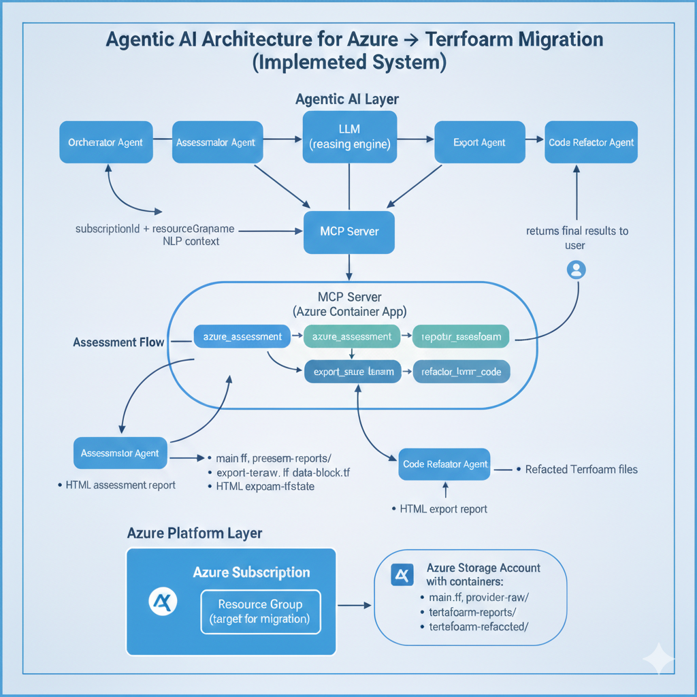
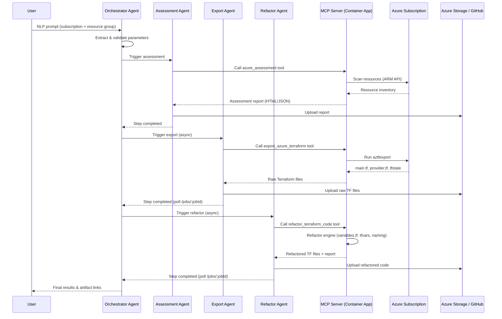
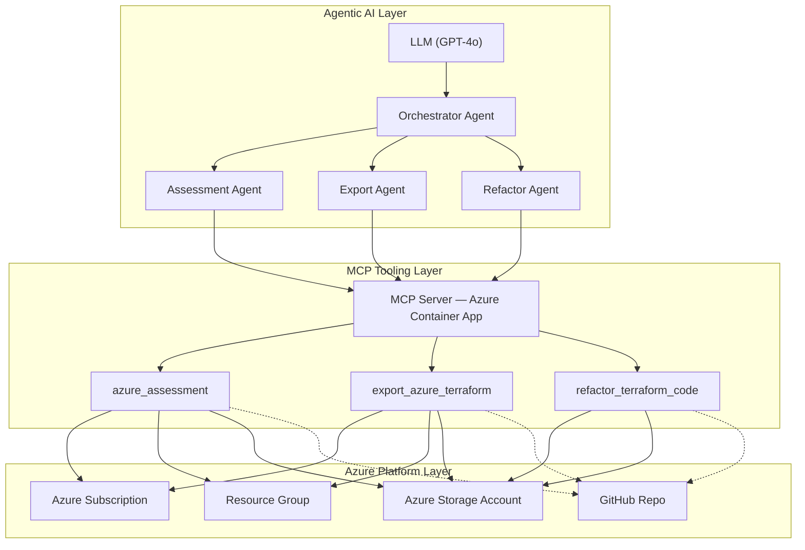

# Azure-to-Terraform Migration — Agentic AI Pipeline

> LLM-driven agents + MCP tools for automated Azure resource assessment, Terraform export, and code refactoring.

**Maintainer**: Sundeep K Maheshwari | **License**: MIT

---

## Table of Contents

1. [System Design & Architecture](#1-system-design--architecture)
2. [Environment Setup](#2-environment-setup)
3. [Docker Build & Container Deployment](#3-docker-build--container-deployment)
4. [Post-Deployment: Secrets & MCP URL Update](#4-post-deployment-secrets--mcp-url-update)
5. [Azure AI Foundry Agent Setup](#5-azure-ai-foundry-agent-setup)
6. [Running the Sequential Workflow](#6-running-the-sequential-workflow)
7. [Agents & Workflow Details](#7-agents--workflow-details)
8. [API — Expose Workflow as REST (Pending)](#8-api--expose-workflow-as-rest-pending)
9. [GitHub Integration](#9-github-integration)
10. [MCP Inspector & Debugging](#10-mcp-inspector--debugging)
11. [Troubleshooting & Fixes](#11-troubleshooting--fixes)

---

## 1. System Design & Architecture

### Architecture Diagram



> Source Visio file: [Architecture.vsdx](Architecture.vsdx)

### Sequence Diagram — Agent Workflow



### High-Level Component Diagram



### Directory Structure

```
apps-mcp-server/
├── index.js                    # Main MCP server entry & SSE logic
├── Dockerfile                  # Container image definition
├── deploy.ps1                  # End-to-end Azure deployment script
├── .env                        # Environment configuration (DO NOT COMMIT)
├── tools/                      # MCP tool definitions
│   ├── assessment.js
│   ├── aztfexport.js
│   └── code-refactor.js
├── ps/                         # PowerShell scripts
│   ├── assessment-AzSubscription.ps1
│   ├── Export-AzToTerraform.ps1
│   └── GitHubHelper.psm1
├── python/                     # Python engines & workflow
│   ├── refactor.py             # Refactor entry point
│   ├── tf_refactor_variable.py # Refactoring logic
│   ├── github_helper.py        # GitHub API integration
│   └── az-fndry-workflow/
│       └── aztf-sequential-wf.py  # Sequential Azure Foundry workflow
└── package.json
```

---

## 2. Environment Setup

### Prerequisites

| Tool | Version | Purpose |
|------|---------|---------|
| **Node.js** | 18+ | MCP server runtime |
| **PowerShell** | 7.x | Assessment & export scripts |
| **Azure CLI** | Latest | `az login` or SPN auth |
| **Python** | 3.10+ | Sequential workflow & refactor engine |
| **aztfexport** | Latest | Must be installed and in PATH |
| **Docker** | Latest | Container build & deployment |

### Install Python Dependencies

```bash
# Azure AI Foundry workflow dependencies
pip install "azure-ai-projects>=2.0.0b4" "openai>=2.24.0" "azure-identity>=1.25.0" "python-dotenv>=1.0.0"

# Assessment & refactor engine dependencies
pip install azure-storage-blob azure-mgmt-resource azure-mgmt-subscription PyYAML requests python-hcl2 jinja2
```

Or install all at once:
```bash
pip install -r apps-mcp-server/python/requirements.txt
```

### Install Node.js Dependencies

```bash
cd apps-mcp-server
npm install
```

### Configure `.env` File

Create/update `apps-mcp-server/.env` with the following values:

```bash
# ===============================================
# Server Configuration
# ===============================================
PORT=3000
LOG_LEVEL=info

# ===============================================
# Azure Authentication (Service Principal)
# ===============================================
AZURE_CLIENT_ID=<your-service-principal-app-id>
AZURE_CLIENT_SECRET=<your-service-principal-secret>
AZURE_TENANT_ID=<your-azure-tenant-id>
AZURE_OBJECT_ID=<your-service-principal-object-id>

# ===============================================
# MCP Server URL (UPDATE AFTER CONTAINER DEPLOYMENT)
# ===============================================
# This is the Container App FQDN — update after running deploy.ps1
MCP_SERVER_URL=https://<your-container-app-name>.<hash>.<region>.azurecontainerapps.io/

# ===============================================
# Azure AI Foundry Project
# ===============================================
AZURE_AI_PROJECT_ENDPOINT=https://<foundry-resource>.services.ai.azure.com/api/projects/<project-name>

# ===============================================
# Output Destination: "azure" | "github" | "both"
# ===============================================
OUTPUT_DESTINATION=both

# Azure Storage (required if destination = azure or both)
storageAccountRG=rg-mcp-servers
storageAccount=samcpstorage

# GitHub (required if destination = github or both)
GITHUB_TOKEN=<your-github-pat>
GITHUB_OWNER=<your-github-org-or-user>
GITHUB_REPO=<your-terraform-repo>
GITHUB_BRANCH=main

# ===============================================
# Script Paths
# ===============================================
POWERSHELL_SCRIPT_PATH=./ps/assessment-AzSubscription.ps1
EXPORT_SCRIPT_PATH=./ps/Export-AzToTerraform.ps1
REFACTOR_SCRIPT_PATH=./python/refactor.py

# ===============================================
# Job Polling (optional tuning)
# ===============================================
JOB_POLL_INTERVAL=15
JOB_POLL_TIMEOUT=1800
JOB_HEARTBEAT_LOG=60
```

### Azure Service Principal Setup

```bash
# Create SPN with Contributor role
az ad sp create-for-rbac --name <sp-name> --role Contributor \
  --scopes /subscriptions/<subscription-id>

# Note the appId, password, and tenant from the output
# Update .env with these values
```

### Output Folder Structure

| Artifact | Storage Path |
|----------|-------------|
| Assessment Reports | `assessment-reports/{subscription_id}/` |
| Export Output | `aztfexport/{subscription_id}/{rg_name}/` |
| Refactored Code | `code-refactored/{subscription_id}/{rg_name}/` |

---

## 3. Docker Build & Container Deployment

### Docker Commands

```bash
# Navigate to the MCP server directory
cd apps-mcp-server

# Build the Docker image
docker build --no-cache -t aztf-mcp-server:v2.3 .

# Test locally (optional)
docker run -p 3000:3000 --env-file .env aztf-mcp-server:v2.3

# Tag for ACR
docker tag aztf-mcp-server:v2.3 <your-acr-name>.azurecr.io/aztf-mcp-server:v2.3

# Login to ACR
az acr login --name <your-acr-name>

# Push to ACR
docker push <your-acr-name>.azurecr.io/aztf-mcp-server:v2.3
```

### Automated Deployment via `deploy.ps1`

The `deploy.ps1` script handles everything end-to-end: ACR creation, Docker build, push, Container App creation, environment variables, and secrets.

```powershell
.\deploy.ps1 `
  -ResourceGroupName "rg-mcp-servers" `
  -SubscriptionId "<subscription-id>" `
  -TenantId "<tenant-id>" `
  -ClientId "<client-id>" `
  -StorageAccountName "samcpstorage" `
  -ContainerName "aztfexport" `
  -ContainerAppName "aztf-mcp-app" `
  -LogAnalyticsWorkspace "workspace-rgmcpserversIh7a" `
  -AcrName "aztfmcpacr" `
  -ImageTag "v2.3" `
  -Port 3000 `
  -MinReplicas 0 `
  -MaxReplicas 1 `
  -Cpu 0.25 `
  -Memory "0.5Gi" `
  -NoCache
```

#### Deployment Parameters

| Parameter | Default | Description |
|-----------|---------|-------------|
| `ResourceGroupName` | `rg-aztf-mcp-prod` | Azure Resource Group |
| `Location` | `eastus` | Azure region |
| `AcrName` | — | Azure Container Registry name |
| `SubscriptionId` | — | Azure Subscription ID |
| `ContainerAppName` | — | Container App name |
| `LogAnalyticsWorkspace` | — | Log Analytics Workspace |
| `ImageTag` | `latest` | Docker image tag |
| `Port` | `8080` | Application port |
| `Cpu` | `1.0` | CPU cores |
| `Memory` | `2.0Gi` | Memory allocation |
| `MinReplicas` | `1` | Minimum replicas |
| `MaxReplicas` | `3` | Maximum replicas |
| `SkipBuild` | `false` | Skip Docker build step |

---

## 4. Post-Deployment: Secrets & MCP URL Update

> **IMPORTANT** — These steps must be done manually after every container deployment.

### Step 1: Update Secrets in Container App

After the container is deployed, go to the **Azure Portal** and update the secrets manually:

1. Navigate to **Container Apps** → your app (e.g., `aztf-mcp-app`)
2. Go to **Settings** → **Secrets**
3. Copy the following values from your `.env` file and add/update them:

| Secret Name | Source (.env key) |
|-------------|-------------------|
| `azure-client-secret` | `AZURE_CLIENT_SECRET` |
| `github-token` | `GITHUB_TOKEN` |

> Secrets are referenced in environment variables via `secretref:azure-client-secret`. The deploy script maps `AZURE_CLIENT_SECRET` and `ARM_CLIENT_SECRET` to this secret automatically.

### Step 2: Get the Container App URL

```bash
# Get the FQDN of the deployed container app
az containerapp show \
  --name aztf-mcp-app \
  --resource-group rg-mcp-servers \
  --query properties.configuration.ingress.fqdn -o tsv
```

This will return something like:
```
aztf-mcp-app.livelyflower-5ea8a87a.centralus.azurecontainerapps.io
```

### Step 3: Update MCP URL in `.env`

Update `MCP_SERVER_URL` in your `.env` file with the Container App URL:

```bash
MCP_SERVER_URL=https://aztf-mcp-app.<hash>.<region>.azurecontainerapps.io/
```

### Step 4: Update MCP URL in Azure AI Foundry Tool Connection

Each Foundry Agent must have its **MCP SSE connection** pointed to the Container App URL:

1. Open **Azure AI Foundry** portal
2. Navigate to each agent:
   - `aztf-assessment-v1`
   - `aztf-export-v1`
   - `aztf-coderefactor-v1`
3. Go to **Tools** → **MCP (SSE)** connection
4. Update the URL to:
   ```
   https://aztf-mcp-app.<hash>.<region>.azurecontainerapps.io/sse
   ```

### Managed Identity Permissions

The Container App needs **System-Assigned Managed Identity** enabled with **Storage Blob Data Contributor** role:

```bash
az role assignment create \
  --assignee $IDENTITY_PRINCIPAL_ID \
  --role "Storage Blob Data Contributor" \
  --scope /subscriptions/<sub-id>/resourceGroups/<rg>/providers/Microsoft.Storage/storageAccounts/samcpstorage
```

---

## 5. Azure AI Foundry Agent Setup

### Required Foundry Resources

1. An **Azure AI Foundry** project with a deployed model (e.g., `gpt-4o`)
2. Four **Foundry Agents** created and connected to the MCP server tool set:

| Agent Name | Purpose | MCP Tool |
|-----------|---------|----------|
| `aztf-orchestrator-v1` | NLP parameter extraction | — (direct LLM) |
| `aztf-assessment-v1` | Azure resource assessment | `azure_assessment` |
| `aztf-export-v1` | Terraform export (async) | `export_azure_terraform` |
| `aztf-coderefactor-v1` | Code refactoring (async) | `refactor_terraform_code` |

### Agent MCP Tool Configuration

Each agent (except orchestrator) must have the **MCP SSE** connection configured:

- **Connection Type**: MCP (Server-Sent Events)
- **URL**: `https://<container-app-fqdn>/sse`

### Required `.env` Variables for Foundry Workflow

| Variable | Example | Description |
|----------|---------|-------------|
| `AZURE_AI_PROJECT_ENDPOINT` | `https://<resource>.services.ai.azure.com/api/projects/<project>` | Foundry project endpoint |
| `MCP_SERVER_URL` | `https://aztf-mcp-app.<hash>.<region>.azurecontainerapps.io/` | Container App base URL |
| `AZURE_CLIENT_ID` | `4a7f6b45-...` | Service Principal App ID |
| `AZURE_CLIENT_SECRET` | `skC8Q~...` | Service Principal secret |
| `AZURE_TENANT_ID` | `a0e1f124-...` | Azure AD Tenant ID |

---

## 6. Running the Sequential Workflow

The sequential workflow runs all four agents in order: Orchestrator → Assessment → Export → Refactor.

```bash
cd apps-mcp-server/python/az-fndry-workflow
python aztf-sequential-wf.py
```

The workflow:
1. Loads `.env` from its directory and the parent `apps-mcp-server/.env`
2. Authenticates via Service Principal (`AZURE_CLIENT_ID` / `AZURE_CLIENT_SECRET`)
3. Runs each agent sequentially via the Foundry SDK
4. Polls `/jobs/:jobId` on the MCP server for async export/refactor completion
5. Outputs results and artifact links

### Local MCP Server Development

For local testing without deployment, use the run script:

```powershell
# Start MCP server locally
.\apps-mcp-server\mcpserver-run.ps1

# With custom port
.\apps-mcp-server\mcpserver-run.ps1 -Port 3000 -ShowDetails
```

---

## 7. Agents & Workflow Details

### 1. Migration Orchestrator Agent

**Purpose**: Extracts and validates user migration requirements from natural language.

- **Input**: User prompt (e.g., *"Migrate rg-app from sub-123"*)
- **Output**:
  ```json
  {
    "subscriptionId": "d0f1884d-1f98-4bf1-9e15-e2986fc1bca2",
    "resourceGroups": ["rg-app-dev", "rg-data-dev"],
    "outPath": "/assessment"
  }
  ```

### 2. Assessment Agent (`infraAzTfAssessmentAgent-v1`)

**Purpose**: Performs managed-only Azure resource assessment.

- Calls `azure_assessment` MCP tool
- Generates HTML/PDF/XLSX reports
- **Output**: Report artifacts uploaded to `assessment-reports/`

### 3. Export Tool (`AztfExportPS-Tool`)

**Purpose**: Exports Azure resources to Terraform HCL and tfstate.

- Runs `aztfexport` via PowerShell
- Handles authentication and temp file management
- **Output**: `main.tf`, `provider.tf`, `terraform.tfstate` → `aztfexport/`

### 4. Refactor Agent (`TerraformRefactor-Agent`)

**Purpose**: Refactors exported code using naming standards and tagging rules.

- Runs `refactor.py` → `tf_refactor_variable.py`
- Enforces tags (owner, businessUnit, etc.)
- Generates `variables.tf`, `terraform.tfvars`, `providers.tf`, `data-sources.tf`
- Applies naming conventions from `naming-standard.json`
- Does NOT add remote backend (preserves local state)
- **Output**: Refactored `.tf` files → `code-refactored/`

---

## 8. API — Expose Workflow as REST (Pending)

The sequential workflow will be exposed as a REST API using **FastAPI**, allowing the `ai-aztfexport-ui` frontend to trigger migration workflows via NLP prompts. Workflow state is tracked **in-memory** — no external database required.

### Endpoints

| Method | Endpoint | Description |
|--------|----------|-------------|
| `POST` | `/api/v1/workflow/trigger` | Trigger workflow from NLP prompt |
| `GET` | `/api/v1/workflow/{workflowId}` | Get workflow status |
| `GET` | `/api/v1/workflows?userId=&limit=20` | List user workflows |
| `GET` | `/health` | Health check |

### Request Example

```bash
POST /api/v1/workflow/trigger
{
  "prompt": "Migrate resources in subscription d0f1884d-... resource group rg-prod-web to Terraform",
  "userId": "user@company.com"
}
```

### Running the API

```bash
cd apps-mcp-server/python
pip install fastapi uvicorn pydantic
uvicorn api.app:app --reload --port 8000
```

- **Swagger docs**: `http://localhost:8000/docs`
- **ReDoc**: `http://localhost:8000/redoc`

---

## 9. GitHub Integration

### Setup

1. Generate a GitHub PAT with `repo` scope
2. Update `.env` with `GITHUB_TOKEN`, `GITHUB_OWNER`, `GITHUB_REPO`
3. Set `OUTPUT_DESTINATION=github` or `both`

### Security Features

- **Branch Protection**: Uploads to specified branch
- **.gitignore Generation**: Auto-excludes `terraform.tfstate`, `.terraform/`
- **SHA Checking**: Avoids unnecessary commits by checking existing file SHAs

---

## 10. MCP Inspector & Debugging

### Testing with MCP Inspector

```bash
# Install/run MCP Inspector
npx @modelcontextprotocol/inspector

# Test local server
npx @modelcontextprotocol/inspector http://localhost:3000/sse

# Test deployed container
npx @modelcontextprotocol/inspector https://<container-app-fqdn>/sse
```

### Stop MCP Port

```powershell
netstat -ano | findstr :3000
taskkill /PID <pid> /F
```

### View Container Logs

```bash
az containerapp logs show --name aztf-mcp-app --resource-group rg-mcp-servers --follow
```

---

## 11. Troubleshooting & Fixes

| Issue | Cause | Fix |
|-------|-------|-----|
| `StorageAccount parameter is required` | Env vars not passed to spawned process | Ensure `tools/aztfexport.js` includes `env: { ...process.env }` |
| Invalid JobId Parameter | Old PS script expected `-JobId` | Updated — uses `{SubscriptionId}/{ResourceGroup}` path |
| SSE Disconnects | MCP SDK or proxy issues | Use Stdio mode for production; ensure client auto-reconnects |
| GitHub Upload 403/404 | Token scope or repo name | Verify PAT has `repo` scope; check `GITHUB_OWNER` |
| `SecretRef not found` | Secret not set in Container App | Manually add secret via Azure Portal (see Section 4) |
| `variables.tf` empty | Refactor engine bug — empty lookup dicts | Fixed in `tf_refactor_variable.py` (populate from variables OrderedDict) |

### Foundry References

- [Agent Framework Workflow Samples](https://github.com/microsoft/agent-framework/blob/main/workflow-samples/CustomerSupport.yaml#L29)
- [Power Fx JSON](https://learn.microsoft.com/en-us/power-platform/power-fx/working-with-json)
- [Foundry Discussions](https://github.com/orgs/microsoft-foundry/discussions/218)

