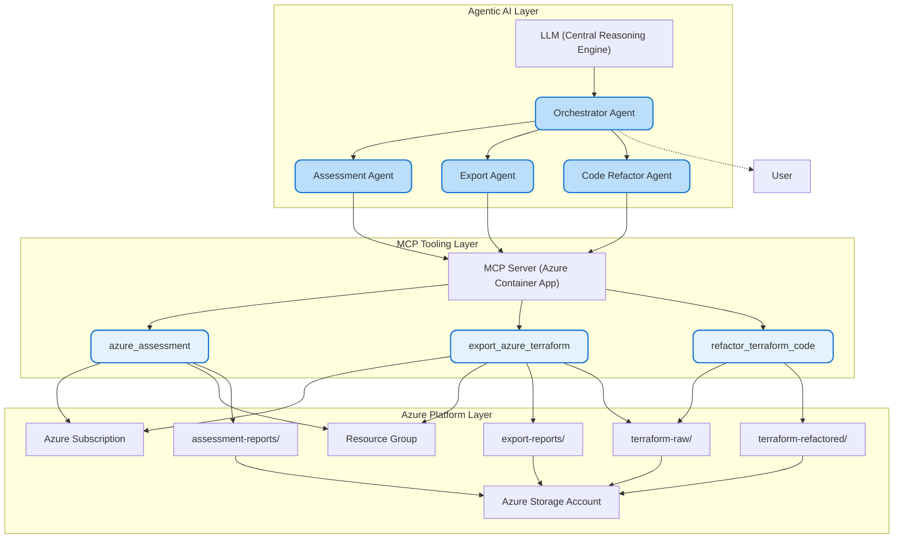

## Solution Design: Implemented System

### Overview
This solution implements an Agentic AI architecture for Azure-to-Terraform migration using LLM-driven agents and MCP tools. The workflow is orchestrated by a central agent, with specialized agents for assessment, export, and code refactoring. All operations are containerized and leverage Azure-native services for scalability and reliability.

### Architecture Diagram

#### Agentic AI Architecture for Azure → Terraform Migration (Implemented System)

### Data Flows
1. **Assessment Flow:**
   - Orchestrator → Assessment Agent → MCP Server → azure_assessment → Azure Subscription/Resource Group
   - Output: HTML assessment report → Storage (assessment-reports/)

2. **Export Flow:**
   - Orchestrator → Export Agent → MCP Server → export_azure_terraform → Azure Subscription/Resource Group
   - Output: main.tf, provider.tf, data-block.tf, terraform.tfstate, HTML export report → Storage (terraform-raw/ + export-reports/)

3. **Refactor Flow:**
   - Orchestrator → Code Refactor Agent → Storage (terraform-raw/) → MCP Server → refactor_terraform_code
   - Output: Refactored Terraform files → Storage (terraform-refactored/)

### Key Implementation Components
- **LLM**: Provides reasoning and context for agent workflows.
- **Orchestrator Agent**: Manages workflow, coordinates agents, and returns results to the user.
- **Assessment Agent**: Evaluates Azure resources for migration suitability.
- **Export Agent**: Exports Azure resources to Terraform files.
- **Code Refactor Agent**: Refactors Terraform code for best practices.
- **MCP Server**: Azure Container App hosting MCP tools for assessment, export, and refactor operations.
- **Azure Storage Account**: Stores reports and Terraform artifacts in dedicated containers.

### Visual & Design Notes
- Azure icons and color palette used for clarity.
- Rounded cards and layered layout for modern presentation.
- Directional arrows show workflow sequencing and data flow.
- All artifacts and containers are labeled for traceability.

---
This architecture is implemented and operational, supporting scalable, agent-driven Azure-to-Terraform migration workflows.

=== Data Flows to Visualize ===
1. Assessment Flow:
   Orchestrator → Assessment Agent → MCP Server → azure_assessment → Azure Subscription/Resource Group
   Output: HTML assessment report → Storage (assessment-reports/)

2. Export Flow:
   Orchestrator → Export Agent → MCP Server → export_azure_terraform → Azure Subscription/Resource Group
   Output: main.tf, provider.tf, data-block.tf, terraform.tfstate, HTML export report → Storage (terraform-raw/ + export-reports/)

3. Refactor Flow:
   Orchestrator → Code Refactor Agent → Storage (terraform-raw/) → MCP Server → refactor_terraform_code
   Output: Refactored Terraform files → Storage (terraform-refactored/)

=== Visual Requirements ===
- Use Azure icons for Azure services.
- Use rounded cards for agents and MCP tools.
- Use a hub-and-spoke or layered layout.
- Use directional arrows to show workflow sequencing.
- Label all artifacts (HTML reports, .tf files, .tfstate).
- Highlight the three MCP tools distinctly.
- Make the diagram clean, modern, and presentation-ready.

Output:
A single, complete architecture diagram visually representing the implemented system.